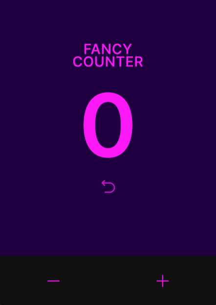

# Fancy Counter App

This project is a simple web application featuring a "Fancy Counter" built with React and powered by Vite. The counter allows users to increment, decrement, and reset the count with a maximum limit of 5. Once the counter reaches this limit, the application will lock and display a message prompting the user to purchase the pro version for higher limits.



## Features

- **Increment**: Increase the count by one.
- **Decrement**: Decrease the count by one.
- **Reset**: Reset the count back to zero.
- **Limit Alert**: When the count reaches 5, the app will lock and display a "Limit reached! Buy pro to use > 5" message.

## Prerequisites

Before you begin, ensure you have the latest version of [Node.js](https://nodejs.org/) installed. This project uses Node.js 20.x or later.

## Installation

To get the project running on your local machine, follow these steps:

1. Clone the repository:
   ```bash
   git clone https://github.com/vmalchik/fancy-counter.git
   cd fancy-counter
   ```
2. Install the dependencies:
   ```bash
   npm install
   ```
3. Start the development server:
   ```bash
   npm run dev
   ```

This will launch the Vite development server and automatically open the app in your default web browser. The default URL http://localhost:5173/

## Usage

The app interface consists of a display showing the current count and three buttons:

- (Plus): Increments the count.
- (Minus): Decrements the count.
- Reset: Resets the count to zero.

Once the counter reaches the maximum limit of 5, further increment actions will trigger a modal or alert that advises upgrading to the pro version.

## Building for Production

To build the application for production, use the following command:

```bash
npm run build
```

## Fonts

Provided by [Google Fonts](https://fonts.google.com/specimen/Inter?query=inter)

## Icons

Provided by [Radix-UI](https://www.radix-ui.com/icons)
